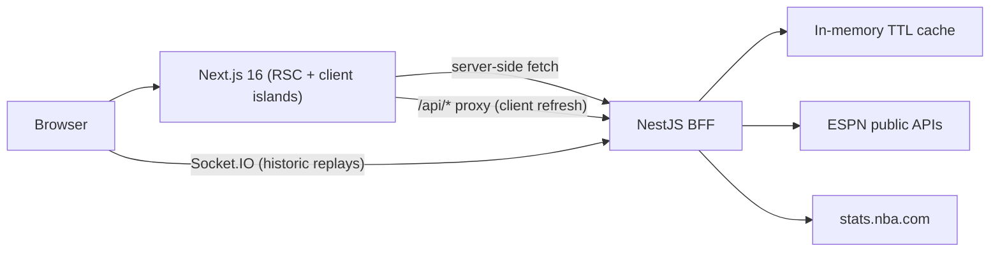

# Hoopscope

[](https://github.com/paulgrape/nba-hub/actions/workflows/ci.yml)
[](LICENSE)
[](https://nodejs.org)

Pro basketball hub: live scores, standings, teams, player profiles, shot heatmaps, news, and play-by-play replays of historic NBA games.

Built as a full-stack TypeScript monorepo: a **Next.js 16** frontend backed by a **NestJS** backend-for-frontend (BFF) that aggregates public ESPN and stats.nba.com data with a resilient HTTP layer (caching, request de-duplication, retry with backoff, stale-data fallback).

## Features

- **Match center** — daily scoreboard and per-game summaries with box scores
- **Historic game replays** — play-by-play streamed over WebSocket (Socket.IO), simulating a live game
- **Teams** — rosters, season player averages, team detail pages
- **Players** — profiles, season and career stats, injuries, player news
- **Shot heatmaps** — per-player shot charts vs. league-wide zone averages
- **Standings** — conference standings with playoff / play-in seeding
- **News** — paginated league news feed with RSS output
- **SEO / analytics** — JSON-LD structured data, sitemap, robots, OG metadata, GTM with Consent Mode and a cookie banner

## Architecture



- **Frontend** (`apps/frontend`) — App Router, React Server Components first; client components only where interactivity is needed (theme, cookie consent, live polling, replay simulator). Domain API modules in `src/lib` share a single typed API client.
- **Backend** (`apps/backend`) — thin domain modules (teams, players, games, news, standings, shots) over two global data-source services:
  - `EspnService` — single resilient entry point for every ESPN call: fresh-cache read, in-flight de-duplication, concurrency throttling, retry with exponential backoff and jitter, stale-cache fallback.
  - `NbaStatsService` — shot chart data from stats.nba.com with the same cache/fallback strategy.
- **Replays** — historic play-by-play is seeded to JSON and streamed tick-by-tick via a Socket.IO gateway.

## Tech stack

| Layer    | Technologies                                                                                                                       |
| -------- | ---------------------------------------------------------------------------------------------------------------------------------- |
| Frontend | Next.js 16, React 19, TypeScript, Tailwind CSS v4, shadcn/Base UI, next-themes, socket.io-client                                   |
| Backend  | NestJS 11, TypeScript, Axios, Socket.IO, Swagger, Throttler, Terminus                                                              |
| Tooling  | npm workspaces, ESLint 9, Prettier, Jest, Vitest + React Testing Library, Husky + lint-staged + commitlint, GitHub Actions, Docker |

## Monorepo layout

```
nba-hub/
├── apps/
│   ├── frontend/   # Next.js app (port 3001)
│   └── backend/    # NestJS API (port 3000, Swagger at /api/docs)
├── .github/        # CI workflow, PR/issue templates, dependabot
├── docker-compose.yml
└── package.json    # npm workspaces root
```

## Getting started

### Prerequisites

- Node.js >= 20
- npm >= 10

### Setup

```bash
git clone https://github.com/paulgrape/nba-hub.git
cd nba-hub
npm install

# environment
cp apps/backend/.env.example apps/backend/.env
cp apps/frontend/.env.example apps/frontend/.env.local

# run both apps (backend :3000, frontend :3001)
npm run dev
```

Open [http://localhost:3001](http://localhost:3001). Swagger API docs are at [http://localhost:3000/api/docs](http://localhost:3000/api/docs).

### Docker (backend)

```bash
docker compose up --build
```

Runs the backend in a container on port 3000; run the frontend locally with `npm run dev -w apps/frontend`.

## Environment variables

### Backend (`apps/backend/.env`)

| Variable                                                                                                      | Default                 | Description                            |
| ------------------------------------------------------------------------------------------------------------- | ----------------------- | -------------------------------------- |
| `PORT`                                                                                                        | `3000`                  | HTTP port                              |
| `FRONTEND_URL`                                                                                                | `http://localhost:3001` | Allowed CORS origin (HTTP + WebSocket) |
| `HISTORIC_GAME_TICK_MS`                                                                                       | `1000`                  | Replay tick interval                   |
| `ESPN_BASE_URL`, `ESPN_WEB_API_BASE_URL`, `ESPN_CORE_BASE_URL`, `ESPN_NOW_API_URL`, `ESPN_STANDINGS_BASE_URL` | ESPN defaults           | Override upstream API bases            |
| `ESPN_RETRY_ATTEMPTS`                                                                                         | `3`                     | Retry attempts per upstream call       |
| `ESPN_RETRY_BASE_DELAY_MS` / `ESPN_RETRY_MAX_DELAY_MS`                                                        | `500` / `8000`          | Backoff window                         |
| `ESPN_MAX_CONCURRENCY`                                                                                        | `5`                     | Max concurrent upstream requests       |
| `ESPN_REQUEST_GAP_MS`                                                                                         | `0`                     | Minimum gap between dispatches         |

### Frontend (`apps/frontend/.env.local`)

| Variable               | Default                 | Description                                              |
| ---------------------- | ----------------------- | -------------------------------------------------------- |
| `NEXT_PUBLIC_API_URL`  | `http://localhost:3000` | Backend URL (also used for Socket.IO)                    |
| `API_URL`              | —                       | Server-side backend URL override (e.g. internal network) |
| `NEXT_PUBLIC_SITE_URL` | `http://localhost:3001` | Absolute URL base for SEO                                |
| `GTM_ID`               | —                       | Google Tag Manager container ID (production only)        |

## Scripts

Run from the repo root:

| Script                                              | Description                             |
| --------------------------------------------------- | --------------------------------------- |
| `npm run dev`                                       | Start backend and frontend concurrently |
| `npm run build`                                     | Build both workspaces                   |
| `npm run test`                                      | Run test suites in both workspaces      |
| `npm run lint -w apps/backend` / `-w apps/frontend` | Lint a workspace                        |

Backend data scripts (run with `-w apps/backend`): `seed:historic-games`, `download:shot-heatmaps`, `build:espn-nba-player-map`.

## Deployment

Deployment is handled by platform-native pipelines; GitHub Actions provides the quality gate (lint, typecheck, test, build) on every pull request.

- **Frontend — Vercel**: import the repo, set the root directory to `apps/frontend`, and configure `NEXT_PUBLIC_API_URL`, `NEXT_PUBLIC_SITE_URL`, and (optionally) `GTM_ID`.
- **Backend — Render**: create a Web Service with root directory `apps/backend`, build command `npm install && npm run build`, start command `npm run start:prod`, and set `FRONTEND_URL` to the Vercel URL plus any `ESPN_*` overrides.

## Testing

```bash
npm run test                      # both workspaces
npm run test -w apps/backend      # Jest unit tests
npm run test:e2e -w apps/backend  # Jest e2e
npm run test -w apps/frontend     # Vitest + React Testing Library
```

## Roadmap

- Replace the in-process TTL cache with Redis for multi-instance deployments
- Real-time NBA game data (current "live" mode replays historic play-by-play)
- Player list/search page
- E2E browser tests (Playwright)

## Data sources & disclaimer

This project consumes **unofficial, public** ESPN and stats.nba.com endpoints for educational/portfolio purposes. It is not affiliated with, endorsed by, or sponsored by the NBA, ESPN, or any of their partners. Upstream endpoints may change or rate-limit without notice; the backend degrades gracefully by serving stale cached data when possible.

## License

[MIT](LICENSE) © Pavel Vinogradov
